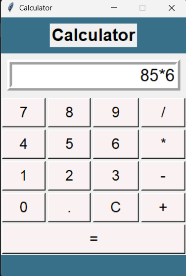

A clean and responsive GUI calculator built with **Python** and **Tkinter** as part of my internship at **CodSoft**.

This is a beginner-friendly project that demonstrates the use of event handling, layout management, custom styling, and user interaction in Python GUI applications.

---

## ✨ Features

- 🔢 Supports basic arithmetic operations: `+`, `-`, `*`, `/`
- ⌨️ Keyboard input + button click support
- 🎨 Hover effects on buttons
- 📱 Responsive layout
- 💡 Clean UI with custom background
- 🧠 Simple logic using `eval()` with error handling

---

## 📸 Screenshot

<p align="center">
  
</p>

---

## 🚀 Getting Started

### Prerequisites

Ensure you have **Python 3.x** installed. Tkinter comes bundled with standard Python installations.

To check:
```bash
python --version
```

### Running the Project

1. Clone the repository:
   ```bash
   git clone https://github.com/logicode-tech/task_01.git
   cd task_01
   ```

2. Run the calculator:
   ```bash
   python app.py
   ```

---

## 📁 Project Structure

```
📦 task_01/
app.py               # Main GUI calculator code
README.md            # Project documentation

## 🛠️ Tech Stack

- **Language:** Python 3.x
- **GUI Library:** Tkinter

---

## 🙋‍♀️ About Me

I'm currently an intern at **CodSoft** and this calculator was my **first task** during the internship!  
Excited to learn, grow, and build more real-world applications like this.

Feel free to connect with me on:

- 🔗 [LinkedIn](https://www.linkedin.com/in/your-profile)
- 💻 [GitHub](https://github.com/severcode-tech)

---

## 📎 Acknowledgements

- Special thanks to **CodSoft** for the opportunity!
- Inspired by basic calculator UI logic and Python-Tkinter community examples.

---

## 📎 Tags

`Python` `Tkinter` `GUI App` `Calculator` `Internship Project` `CodSoft` `Beginner Friendly` `Open Source`

